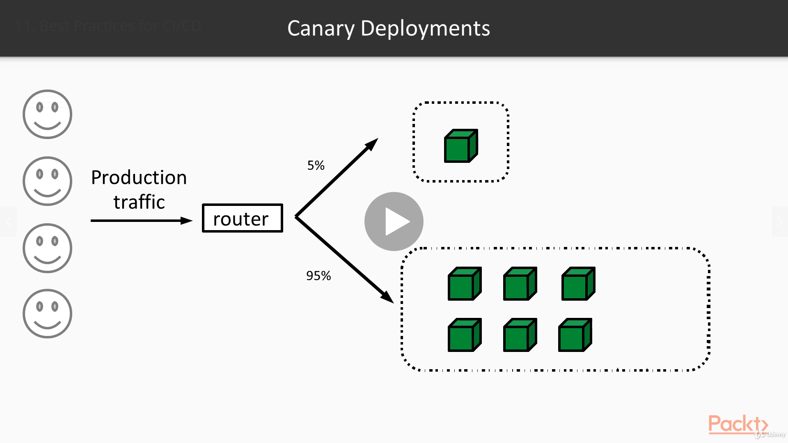

# Microservices Architecture

## Reference Documentation

This project is a summary to the fourth part of Dimos Raptis's course on Udemy.

It is based primarily on the references below:

* [Microservices Architecture](https://www.udemy.com/course/microservices-architecture/)


### Features

These are the key features that we'll cover in this project:

- Continuous Delivery

- AWS CodePipeline

- Best Practices for CI/CD


## Continuous Delivery Using AWS Pipeline

In this part, we will explain the concept of Continuous Delivery, giving some basic examples and demonstrating a simple implementation.

`Continuous Delivery is a software engineering approach in which teams produce software in short cycles, ensuring that it can be released easily, quickly, and reliably.`

Looking back into our previous projects, it builds on top of Continuous Integration, allowing developers to not only integrate their code changes frequently, but also get it in Production in a quick and safe way.

The main mechanism behind this approach is the so-called Continuous Delivery Pipeline.

This helps us model the different stages that our code will pass through in order to reach Production from our Development machine.

This is supposed to automate as many options as possible so that developers can focus on writing software.

It also provides a place where developers can see where their code change is now and if it has any issue, what was the reason.

- Continuous Delivery x Continuous Deployment

These two concepts are very often confused.

So, let's try to clarify what's the main difference between them.

Continuous Deployment is a specific case of Continuous Delivery, where changes in the source code are automatically promoted to Production without any manual approval from a person.

Any existing checks are all automated.

On the other hand, Continuous Delivery can have some manual checks, such as a stage where people have to perform some manual testing before verifying that the code is safe for Production.

As always, there is no silver bullet.

Which one you need to use depends on your project and the nature of the software you release.

Now, we'll see how a simple CI/CD Pipeline can look like.

We should keep in mind that pipelines can get much more complicated, but we'll keep it simple for a start.

- Build

As we've already seen, it all starts with a Build stage, which is responsible for building our source code and producing an artifact.

- Test

After that, we can have a stage with some basic tests, such as Unit Tests, checks on the Code Coverage level and potentially other Static Analysis checks, which can helps us make sure we are keeping code quality high.

- Integration

Later on, there is a stage which contains an Integration environment, where we'll probably run some Integration Tests, and perhaps some Stress Tests to make sure we are not introducing any performance regressions.

- Staging

Quite often, we will also see a staging environment, which can be an exact replica of our Production environment which is only accessible to internal employees.

This can be used to perform End-to-End Tests, and User Acceptance Testing (UAT), without impacting our customers.

- Production

The last and most important is the stage that deploys our code to our Production environment. This could also contain some basic checks. An example would be some Smoke Tests, which just validate that the service is healthy and responsive to basic requests.


What a Simple CI/CD Pipeline Looks Like, by Dimos Raptis, [Udemy](https://www.udemy.com/course/microservices-architecture/).

Let's see now how we can build such a pipeline using AWS.

First, let's create an S3 bucket for the pipeline artifacts and enable versioning:

```
aws s3api create-bucket --bucket com.packtpub.soss.catalogservice.delivery.pipeline
aws s3api put-bucket-versioning --bucket com.packtpub.soss.catalogservice.delivery.pipeline --versioning-configuration Status=Enabled
```

Then, let's create an IAM role for CodePipeline:

```
aws iam create-role --role-name CodePipelineRole --assume-role-policy-document file://aws/code_pipeline_trust_policy.json
aws iam put-role-policy --role-name CodePipelineRole --policy-name CodePipelineRolePolicy --policy-document file://aws/code_pipeline_role_policy.json
```

After that, we can create the CodePipeline:

```
aws codepipeline create-pipeline --pipeline file://aws/code_pipeline.json
```

Then, we should update the EC2 role policy. This is needed, because during deployments, EC2 servers now need access to the artifacts from the CodePipeline.

```
aws iam put-role-policy --role-name EC2-AppServer-Role --policy-name EC2-AppServer-Permissions --policy-document file://aws/ec2_app_server_policy.json
```

This is the Continuous Delivery Pipeline we've built for our Catalog Service.


As we can see, it is quite simple and consists of three stages: one for retrieving the source code; one for building the artifact and running all the unit tests; and one for deploying to our Production environment.

Let's first have a look on the configuration we used for that pipeline.

```
{
    "name": "CatalogService-Pipeline",
    "version": 1,
    "roleArn": "arn:aws:iam::002029326096:role/CodePipelineRole",
    "artifactStore": {
      "type": "S3",
      "location": "com.packtpub.soss.catalogservice.delivery.pipeline"
    },
    "stages": [
      {
        "name": "Source",
        "actions": [
          {
            "name": "Source",
            "runOrder": 1,
            "actionTypeId": {
              "category": "Source",
              "owner": "AWS",
              "provider": "S3",
              "version": "1"
            },
            "configuration": {
              "S3Bucket": "com.packtpub.soss.catalogservice.source",
              "S3ObjectKey": "CatalogService.zip",
              "PollForSourceChanges" : "true"
            },
            "inputArtifacts": [],
            "outputArtifacts": [
              {
                "name": "CatalogServiceSource"
              }
            ]
          }
        ]
      },
      {
        "name": "Build",
        "actions": [
          {
            "name": "Build",
            "runOrder": 1,
            "actionTypeId": {
              "category": "Build",
              "owner": "AWS",
              "provider": "CodeBuild",
              "version": "1"
            },
            "configuration": {
              "ProjectName": "CatalogService_CodeBuild_project"
            },
            "inputArtifacts": [
              {
                "name": "CatalogServiceSource"
              }
            ],
            "outputArtifacts": [
              {
                "name": "CatalogServiceBuildArtifact"
              }
            ]
          }
        ]
      },
      {
        "name": "Prod",
        "actions": [
          {
            "name": "Deploy",
            "runOrder": 1,
            "actionTypeId": {
              "category": "Deploy",
              "owner": "AWS",
              "version": "1",
              "provider": "CodeDeploy"
            },
            "configuration": {
              "ApplicationName": "CatalogServiceApp",
              "DeploymentGroupName": "CatalogServiceDG"
            },
            "inputArtifacts": [
              {
                "name": "CatalogServiceBuildArtifact"
              }
            ],
            "outputArtifacts": []
          }
        ]
      }
    ]
}
```
As we can see, the configuration contains an array of Stages.

The first one is the Source stage, which fetches the source code from S3, and more specifically from the source bucket.

As we can see, there are no input artifacts since this one is the first stage. And there is one output artifact, and there is one output artifact, which is the source code itself.

The second one is the Build stage, which receives as input the source code from the previous stage and uses CodeBuild to build the artifact, using our existing CodeBuild project.

The last stage is the Production stage, which receives the artifact as input from the previous stage and deploys it to our Auto Scaling group, using the existing CodeDeploy application.

Let's give our pipeline a try.

Our pipeline will be triggered if we upload a new version of our code automatically. But for our demo, let's trigger it manually by clicking the Release change button, and it will pick up the latest version.

The Source stage started and it will start downloading the source from the S3 bucket.


As soon as it is completed, the next stage will start, and a link for more details will appear.


By clicking on it, we'll be able to see the specific build running with more details. This is useful in case something goes wrong and we want to troubleshoot or we're looking for something specific to the build execution.

It will take a while for CodePipeline to identify that the build has been completed.

CodePipeline has now identified that the build has been completed and started a deployment.


Again, a Details link will appear after a while. By clicking on it, we will be able to see more information about the deployment that is currently running.

Now, we can see that our Deployment is ready. 


Then, we can go back to our server and see that there is a newer version of the Catalog Service deployed.


## Best Practices for CI/CD

In this section, we will start looking at some best practices when using Continuous Delivery and what we should be careful about.

When doing Continuous Delivery, there is an evident trade-off between Speed and Safety. We've been saying so far that in order to become efficient in building software, we have to remove the human factor and try to automate processes as much as possible.

However, this automation can be quite risky. Sometimes, we might need to compromise on the Speed of delivery to ensure we won't break important funcionality.

In the rest of this section, we'll encounter these tradeoffs being a main theme of our discussions. It's one of things we'll have to consider as well when making decisions about our systems.

### Testing

As we've seen, one of the main mechanisms of writing reliable software is via testing.

However, there are a lot of different categories of tests.

Mike Cohn introduced the concept of the Test Pyramid in his book Succeeding with Agile. So, we'll use that as a framework for our discussion.

The first layer of testing is Unit Tests.

We won't go into what defines a unit here, but we can think of Unit Tests as tests which can be run very quickly and testing only a very small and specific part or functionality, such as a specifi method or a class.

Ideally, they don't use any network or file system resources.

The second layer of testing was initially called Service Tests. The naming originates from the fact that their goal is to test one service in isolation from its dependencies.

This can be achieved by stubbing the responses of dependent services.

Sometimes, when we have to do with data stores, we use a real data store instead of stubbing it.

We might hear these tests called Integration Tests, but what we care about is that they are only testing the code of a single service.

The third and last layer was called UI Testing.

But nowadays, it is commonly referred to as End-to-End Testing. This is because, in these tests, we are trying to verify the functionality of all our services together.

As we can see, as we move up, the tests have a larger scope, and can give us more confidence.

However, as we move down, tests are faster and it is easier for us to identify what is broken.

For that reason, a good approach is to make an effort on covering as many cases as possible via Unit Tests.

Then, we can have some Service Tests to make sure that all the components of our service are working as expected in cooperation. 

But we should strive for having the smallest number of End-to-End tests required, to make sure we maintain a small feedback cycle.


Test Pyramid, by Dimos Raptis, [Udemy](https://www.udemy.com/course/microservices-architecture/).


### CDC Testing

A new concept was born out of the microservices movement called Consumer Driven Contract Testing (CDC Testing).

This is a technique that we can use to ensure that new code changes won't break our consumers without having to resort to End-to-End testing.

In this approach, consumers initially define their expectations from our service via a Domain Specific Language (DSL).

This is used to generate some specifications for our API, ideally in a format that's interoperable between languages, such as JSON.

With that specification in hand, we can start Mock Servers of the Producer and the Consumer.

The former can be used by our Consumers to make sure they will be able to communicate effectively with our service.

The latter can be used by us to make sure that new code changes will satisfy the expectations set by our Consumers.

There are several open source frameworks that provide an easy way to apply that technique.

One of the most popular ones is Pact, which also helps us to store the specification artifacts in central stores and share it between teams as part of our build process.


CDC Testing, by Dimos Raptis, [Udemy](https://www.udemy.com/course/microservices-architecture/).


### The Need for End-to-End Testing

Let's look at a very simple example to contemplate on whether we actually need End-to-End tests and to what extent.

As we said, using Unit Tests and Service Tests we should be able to verify that our services work as expected.

If we also use CDC tests, as explained previously, we can also verify that the communication between each pair of services is successful.

But if we verify the functionality of each part independently, and their interactions as well, doesn't that mean that we verified the system as a whole?

Here, we have to admit that it is completely reasonable to need some End-to-End tests to feel confident.

But keeping them to a low number is important for our capability to deliver software quickly.


The Need for End-to-End Testing, by Dimos Raptis, [Udemy](https://www.udemy.com/course/microservices-architecture/).


### The Fallacy of Testing Everything

A common fallacy about testing is that we should test every single Use Case of our software, ideally using all available ways of testing. In this way, we will guarantee that we never release a single bug.

The painful truth is that real life software systems are highly complex. On top of that, users are going to use our software in ways that we can never imagine.

As a result, the approach of testing everything before releasing to Production is not very realistic.

It also makes our release process extremely slow, coming into conflict with one of the key principles of microservices, which is allowing us to deliver software faster.

When adopting microservices, we have to embrace the fact that we won't always be able to detect all the defects before releasing to Production.

Accepting that fact is a shift in our thinking, and makes us think what we can do to minimize the impact of these cases.

This is sometimes called Testing in Production, and it is widely used accross the industry nowadays.

So, let's explore some techniques that allow us to do that.


#### Blue/Green Deployments

A very common way of performing deployments is the Blue/Green Deployments technique.

We can see an example here, where we have an existing fleet of servers receiving our Production traffic.

During a deployment, we create a new fleet of servers, having the new version of the code.

After we make sure that these new servers are healthy and operate normally, we shift all the traffic from the first fleet to the second one.

If anything is wrong with the new code, we can easily switch back to the previous version. After running the new code for a while, and confirming that everything is good, we can tear down the old fleet.

As we can see here, the servers with the old version of the code are marked with blue color here while the servers with the new version are colored green. This coloring is the origin of the technique's name as well.


Blue/Green Deployments, by Dimos Raptis, [Udemy](https://www.udemy.com/course/microservices-architecture/).


This technique is very simple to implement, but it's quite wasteful in terms of resources.

Also, any existing bug in the new code will be exposed to many customers until we switch back to the old one.

#### Canary Deployments

Another technique that does not have these drawbacks is called Canary Deployments.

In this approach, we deploy the new version of the code to a new instance. Then, we only switch a small percentage of the traffic to this instance to ensure that new code behaves well. When that's confirmed, we deploy the new code to the rest of the servers.

This requires a lot less resources and the risk is much smaller since only a small percentage of the customers is exposed to the new code.

There are also ways which customers will see the new code to reduce that risk even more.

A real example from industry is Facebook which releases every code change first to their internal employees.



Canary Deployments, by Dimos Raptis, [Udemy](https://www.udemy.com/course/microservices-architecture/).


### Rolling Deployments

A third approach which optimizes for Speed trading some Safety, is called Rolling Deployment.

In this approach, the new code is first deployed to a server of the existing fleet and receiving regular traffic.

There is a specific period of time waiting for the server to handle traffic without any problem until verifying that the code worked fine.

At that point, the next server is selected and the same process is followed. That is done repeatedly with one server at a time until the process is complete.

If at any time there is an indication of something wrong, such as application errors or slow responses, all the servers are switched back to the old version and the deployment is considered failed.


Rolling Deployments, by Dimos Raptis, [Udemy](https://www.udemy.com/course/microservices-architecture/).


### Things to Keep in Mind

After all this, we'll try to recap here and point out some of the things we need to consider when setting up our Continuous Delivery pipeline.

#### Reduce test coverage overlap

First of all, we have to make sure that there is not a lot of overlap in the functionality covered by our various tests.

If something is covered by two different categories of tests, we should keep only the test in the category that is lower in the pyramid.

If we discover a new bug, we should try to either test as lowest as possible.


#### Avoid environment drift during performance testing

If we are doing Performance Testing, we should make sure that the environment we are using has the same resources and configuration as the Production one. Otherwise, the results will not be reliable.

#### Work in a single branch, using feature toggles

We should try to encourage the development team to work in a single branch instead of multiple branches for different features.

When we are working on a new feature added to the main branch with an associated feature toggle that switches it on, that will help our developers integrate their software more easily.


#### Automate everything with sensible human switches


All the deployment techniques we previously described are highly complex.

We should not expect the human to do all these things and develop an automated process.

Of course we should always provide ways to humans to override the process and do something different, such as a manual rollback, when it is needed.


#### Have a quick rollback mechanism


We will also need to have a quick rollback mechanism in case something goes wrong.

In Canary Deployments, this can be done by having symbolic links to the different versions of the code.

In Blue/Green Deployments, we have to stay away from slow routing methods. For example, if we are changing the routing using DNS entries, we can't be sure that the customers are seeing what we think, since there are multiple places where DNS is cast in the journey from a browser to our server.

A safe technique is to use a Load Balancer for that switches.


#### Avoid synchronizing deployments with other processes


Synchronizing the deployments with other processes such as database migrations or other services deployments is a recipe for disaster.

Each service should be deployable completely independently.


#### Think about side-effects of bad deployments


When using the deployment approach we discussed previously, we should think carefully about the side effects of a bad code change.

One important thing to consider is whether our service is stateful, which is whether it stores data that affects its behaviour or just retrieves data from other services.

If our service is stateful, then defective can have irreversible impact by corrupting our data.

That means that a simple rollback to the previous version of the code won't be enough.

So, we'll probably have to err on the side of safety when making decisions about our deployment process.


#### MTBF versus MTTR


Lastly, we should try to understand these two metrics and the difference between them. The first one is Mean Time Between Failures. And the second one is Mean Time To Recovery.

By measuring them continuously and inspecting them, we can decide whether it is worth investing more time in our testing methodologies or in the way we release and operate our software.


